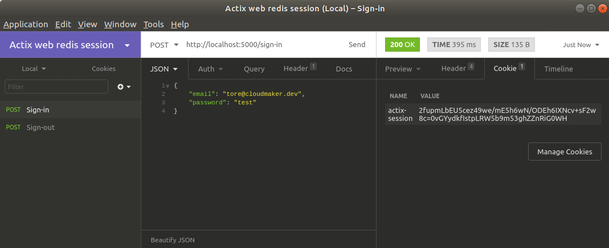

In this tutorial, we are going to create Authentication for the REST API that we made in the [last tutorial](/how-to-create-a-rest-api-in-rust/), so I highly recommend reading that first. Alternatively, you can clone the code from the last tutorial on [github](https://github.com/thecloudmaker/actix_tutorials/tree/master/rest_api).
We will be using Redis for handling our sessions, so if you don’t have Redis installed on your computer, you should do that first.

## Password hashing

You should never store real user passwords in the database unencrypted. So let’s start with encrypting the passwords. For hashing the passwords we going to use `Argon2`. `Argon2` is known for being a secure hashing algorithm and even won the [Password Hashing Competition (PHC)](https://password-hashing.net/). We are also going to need a random generator for creating a salt. So let’s add the dependencies to our `Cargo.toml`.

``` toml
[dependencies]
rand = "0.7"
rust-argon2 = "0.5"
```

We are going to hash the password as part of our `User` creation API and while we are at it we can create a function for verifying the password.

<<< @/blog/authenticate-api-users/model.rs

For creating the hash you can see that we are using a random 32-bit salt for each password. This is to avoid that users that have the same password ends up having the same password hash and it also makes it harder for an attacker to crack the passwords.

It not good a practice to send the password hash back to the user. `Serde` makes it quite easy to hide the password hash from the user, by skipping serialization of the password.

``` rust
// src/user/model.rs
#[derive(Serialize, Deserialize, Queryable, Insertable)]
#[table_name = "user"]
pub struct User {
    pub id: Uuid,
    pub email: String,
    #[serde(skip_serializing)]
    pub password: String,
    pub created_at: NaiveDateTime,
    pub updated_at: Option<NaiveDateTime>,
}
```
We can now try to create a new user over with our user create endpoint and we will see that the user password is encrypted in our database.

## Register user

Registering a user is going to be a simple task. We technically already have an endpoint for that. But let’s make the registration a part of our new auth module. So let’s make the auth module with a registration endpoint.

``` rust
// src/auth/routes.rs
use crate::api_error::ApiError;
use crate::user::{User, UserMessage};
use actix_web::{post, get, web, HttpResponse};

#[post("/register")]
async fn register(user: web::Json<UserMessage>) -> Result<HttpResponse, ApiError> {
    let user = User::create(user.into_inner())?;
    Ok(HttpResponse::Ok().json(user))
}

pub fn init_routes(cfg: &mut web::ServiceConfig) {
    cfg.service(register);
}
```

We also need to make the init method for the routes available outside of the module.

``` rust
// src/auth/mod.rs
mod routes;

pub use routes::init_routes;
```

Then we can connect our new module with the rest of our application.

``` rust
// src/main.rs
// ...
mod auth;

#[actix_rt::main]
async fn main() -> std::io::Result<()> {
    // ...
    let mut server = HttpServer::new(|| 
        App::new()
            .configure(auth::init_routes)
    );
    // ...
}
```

Now our new registration endpoint should work in the same fashion as our user create endpoint worked.

## Sign in and out

I have found quite a lot of tutorials suggestion to use json web tokens for handling sessions and that they are supposed to be more secure than storing the session data in a cookie. But where are you going to store your token? Maybe in a cookie? By doing that we can still be a subject of a CSRF attack, which I have heard that many people say that you can avoid by using json web tokens. The other alternative is to store the token in the session storage. Now you might be secure against CSRF attacks, but you could now be exposed to XSS attacks which could be even more dangerous.

A more secure way to store session data is on the server-side in a key-value store like Redis. We can still be a subject of CSRF attacks since we need to store our session key in a cookie. So make sure to protect yourself against these kinds of attacks before you deploy your application to production. CSRF attacks are a more complex topic, so I will be covering that more in-depth in a separate blog post in the future.

For handling sessions, we are going to need another couple of dependencies.

``` toml
[dependencies]
actix-redis = { version = "0.8", features = ["web"] }
actix-session = "0.3"
```

To let our application know where to find Redis we are going to add another couple of environment variables.

```
REDIS_HOST=127.0.0.1
REDIS_PORT=6379
```

We also have to set up the middleware that will handle the sessions for us.
``` rust
// src/main.rs
// ...
use actix_redis::RedisSession;

#[actix_rt::main]
async fn main() -> std::io::Result<()> {
    // ...
    let redis_port = env::var("REDIS_PORT").expect("Redis port not set");
    let redis_host = env::var("REDIS_HOST").expect("Redis host not set");

    let mut server = HttpServer::new(move|| 
        App::new()
            .wrap(RedisSession::new(format!("{}:{}", redis_host, redis_port), &[0; 32]))
            .configure(auth::init_routes)
    );
    // ...
}
```

For signing in, we need to be able to find a user only by knowing the email. One way to find the user by email is by extending our user API with a new method.

``` rust
// src/user/model.rs
// ...
impl User {
    pub fn find_by_email(email: String) -> Result<Self, ApiError> {
        let conn = db::connection()?;

        let user = user::table
            .filter(user::email.eq(email))
            .first(&conn)?;

        Ok(user)
    }
    // ...
}
```

Also for convenience, we are going to make a default way for handling Actix errors. This way we can use the question mark to handle these kinds of errors instead of explicitly having to map each of these errors to `ApiError`.

``` rust
// src/api_error.rs
use actix_web::error::Error as ActixError;
// ...

impl From<ActixError> for ApiError {
    fn from(error: ActixError) -> ApiError {
        ApiError::new(500, error.to_string())
    }
}
```

Now we can create the endpoints for signing in and out.

``` rust
// src/auth/routes.rs
use actix_session::Session;
use serde_json::json;
use uuid::Uuid;
// ...

#[post("/sign-in")]
async fn sign_in(credentials: web::Json<UserMessage>, session: Session) -> Result<HttpResponse, ApiError> {
    let credentials = credentials.into_inner();

    let user = User::find_by_email(credentials.email)
        .map_err(|e| {
            match e.status_code {
                404 => ApiError::new(401, "Credentials not valid!".to_string()),
                _ => e,
            }
        })?;
  
    let is_valid = user.verify_password(credentials.password.as_bytes())?;

    if is_valid == true {
        session.set("user_id", user.id)?;
        session.renew();

        Ok(HttpResponse::Ok().json(user))
    }
    else {
        Err(ApiError::new(401, "Credentials not valid!".to_string()))
    }
}

#[post("/sign-out")]
async fn sign_out(session: Session) -> Result<HttpResponse, ApiError> {
    let id: Option<Uuid> = session.get("user_id")?;

    if let Some(_) = id {
        session.purge();
        Ok(HttpResponse::Ok().json(json!({ "message": "Successfully signed out" })))
    }
    else {
        Err(ApiError::new(401, "Unauthorized".to_string()))
    }
}

pub fn init_routes(cfg: &mut web::ServiceConfig) {
    cfg.service(register);
    cfg.service(sign_in);
    cfg.service(sign_out);
}
```

If we now hit our sign-in endpoint we should be able to see the session key as a part of the cookie, if we have already registered the user. We can also try sign-out, and we will then see that the cookie will be deleted. I used [Insomnia](https://insomnia.rest/) for testing it.



## Using the session data

Now let’s use the session data to get out the user information. So let’s create an endpoint that will give us the user data for the signed-in user.

``` rust
// src/auth/routes.rs
// ...
#[get("/who-am-i")]
async fn who_am_i(session: Session) -> Result<HttpResponse, ApiError> {
    let id: Option<Uuid> = session.get("user_id")?;

    if let Some(id) = id {
        let user = User::find(id)?;
        Ok(HttpResponse::Ok().json(user))
    }
    else {
        Err(ApiError::new(401, "Unauthorized".to_string()))
    }
}

pub fn init_routes(cfg: &mut web::ServiceConfig) {
    cfg.service(register);
    cfg.service(sign_in);
    cfg.service(sign_out);
    cfg.service(who_am_i);
}
```

Now if we hit the newly created endpoint we should get the user data if we are signed in and a status 401 if we are not.

The complete source code for this tutorial is available on [github](https://github.com/thecloudmaker/actix_tutorials/tree/master/authentication) in case you need it.

## What is up next?

Next up I will be creating a tutorial for how we can verify the user by email verification. In case you are interested you can sign up for the newsletter to be the first to know.
